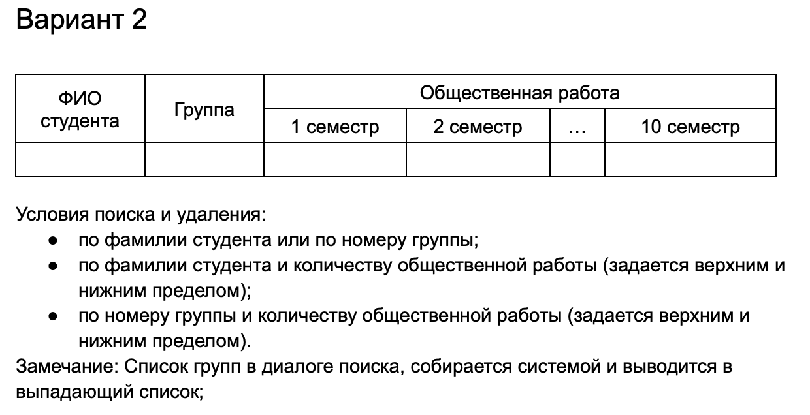
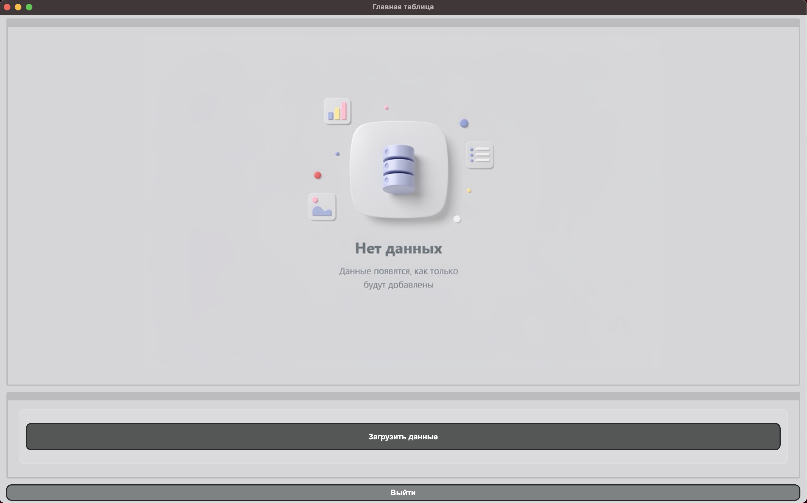
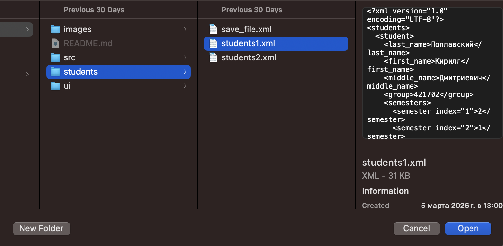
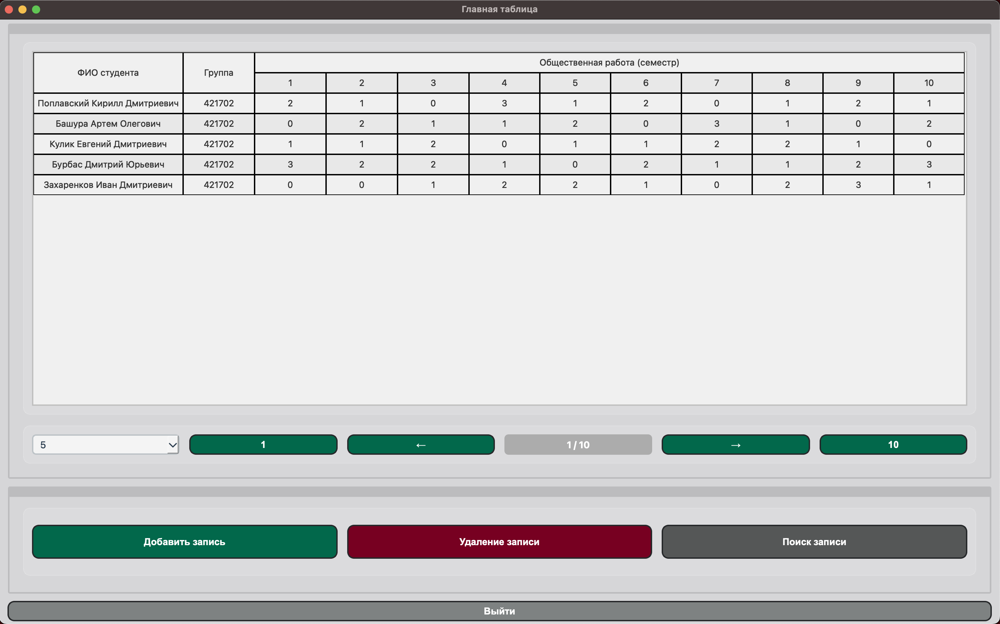
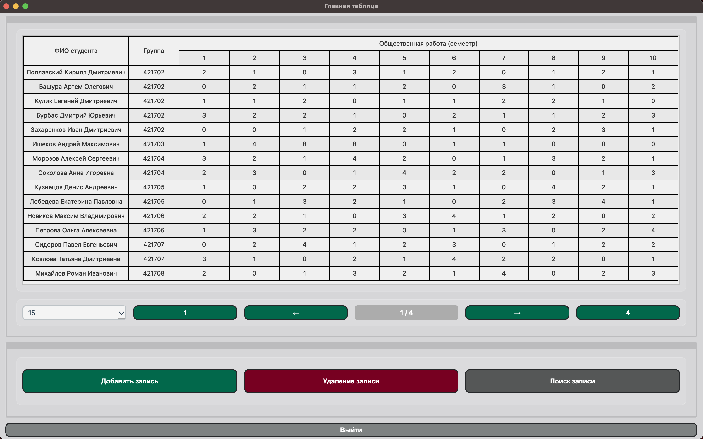
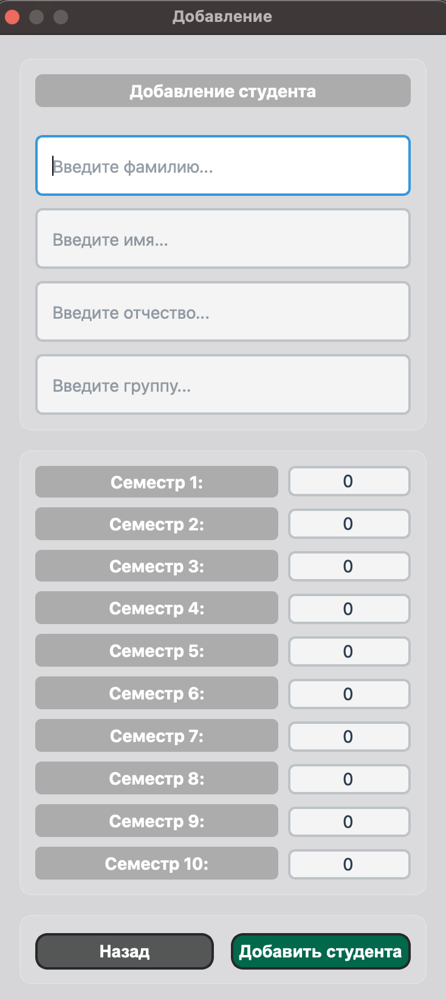
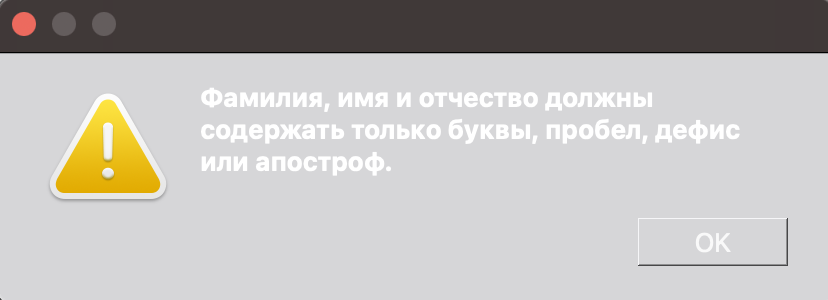
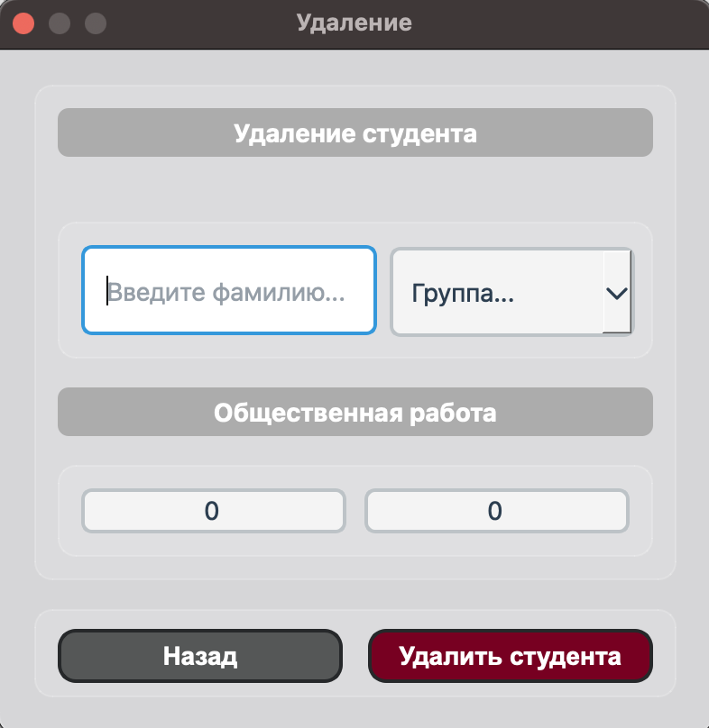
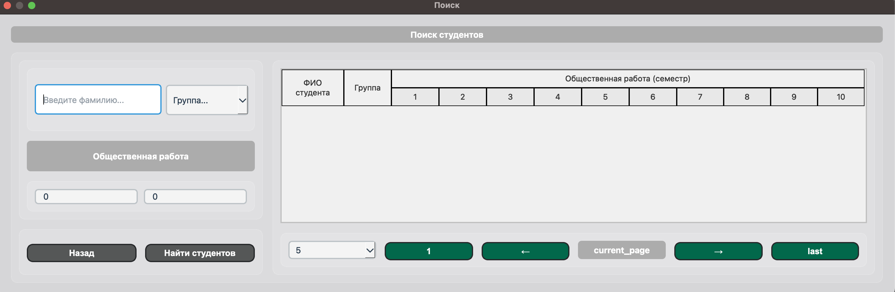
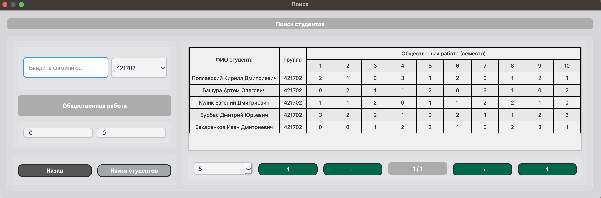

# Lab 2 Variant - Social Work By Semesters

</img>

Используемые технологии:
- Pyside6

### Функциональные возможности программы
- Сохранение/загрузка данных в файлы .xml
- Добавление студентов
- Удаление студентов по заданным условиям
- Поиск студентов по заданным условиям
- Пагинация

### Демонстрация работы программы

Вид окна загрузки данных из файла: \
</img>

Загрузка файла: \
</img>

Окно таблицы: \
</img>

Демонстрация работы пагинации: \
</img>

Окно добавления студента: \
</img>

Ошибка при заполнении: \
</img>

Окно удаления: \
</img>

Окно поиска: \
</img>

Результат поиска: \
</img>

### Вывод:
В результате лабораторной работы был разработан GUI для взаимодействия с xml-файлом, содержащим студентов и реализовал выполнение CRUD операций с данными о студентах.