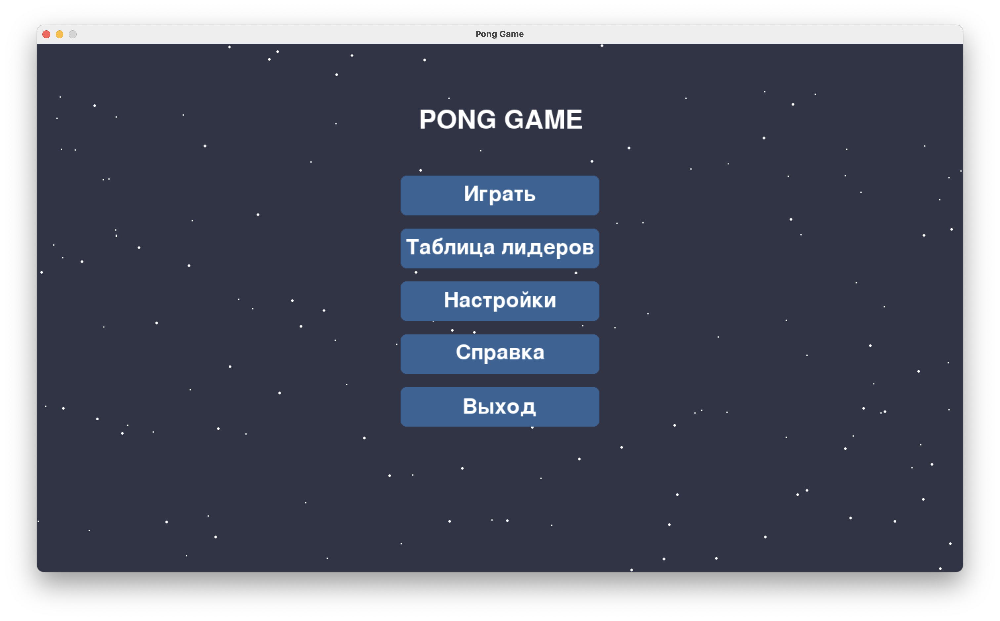
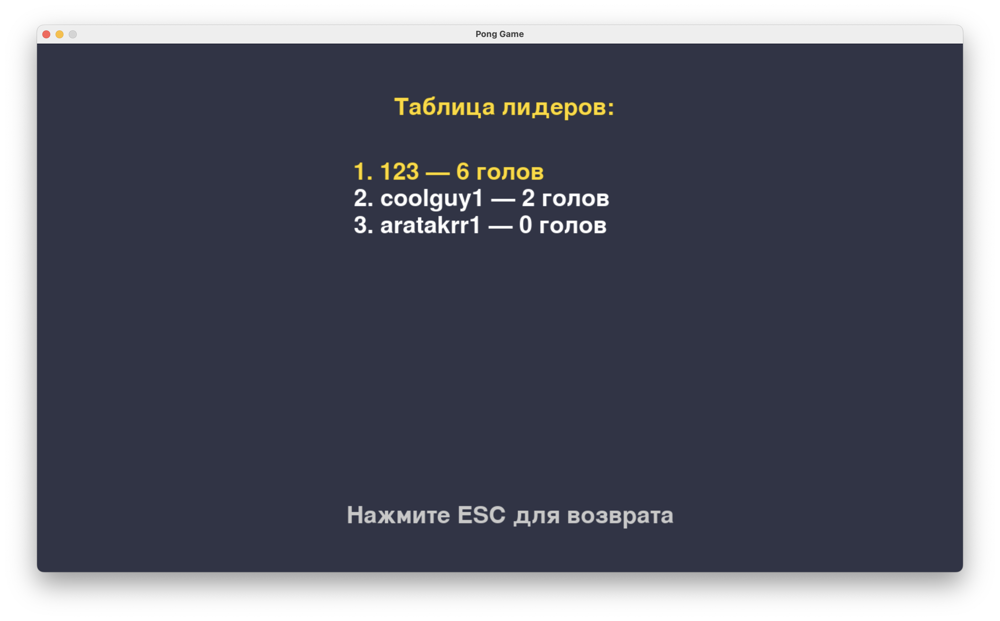
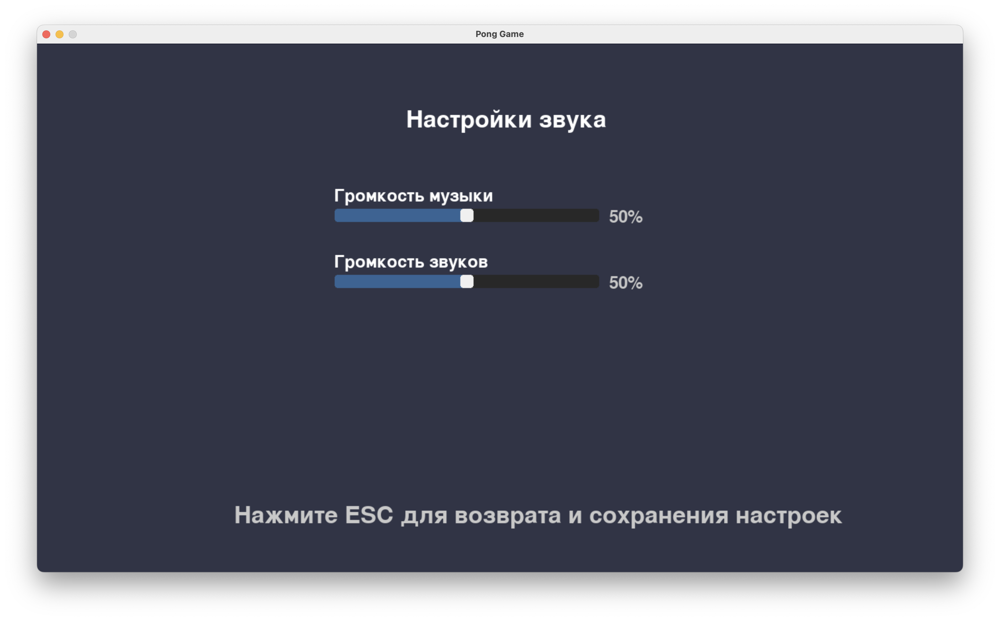
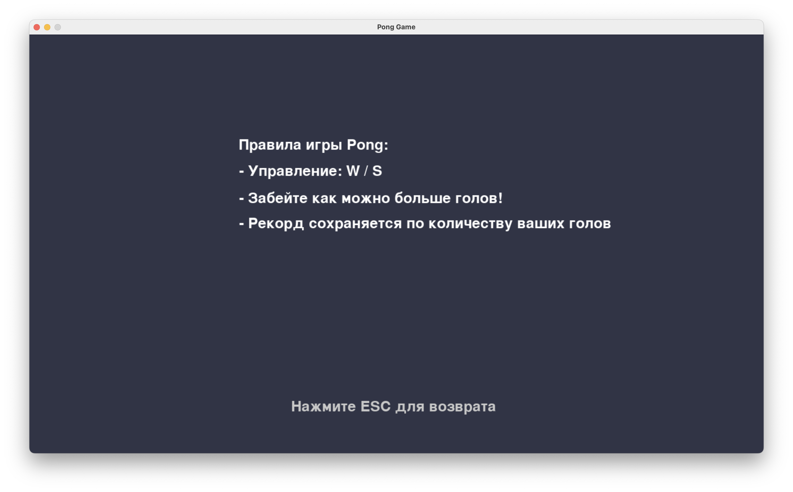
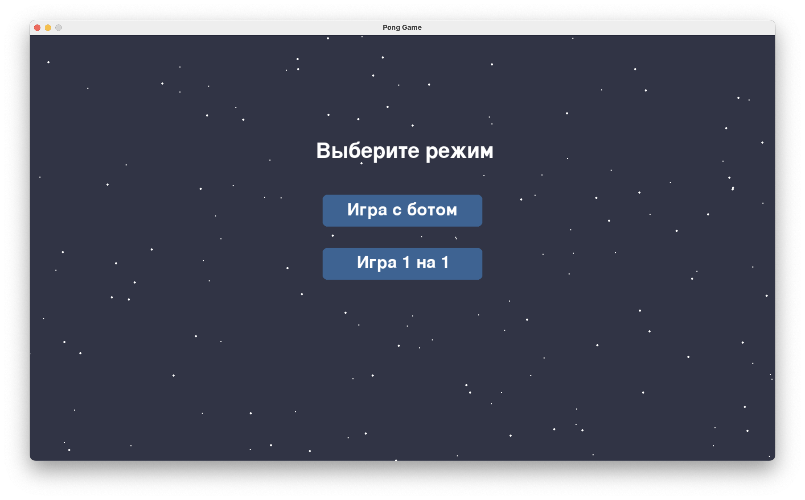
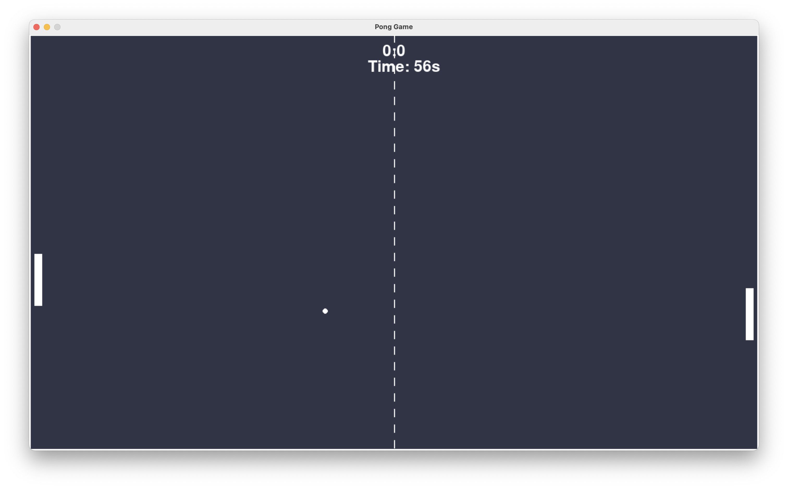

# Лабораторная работа 3
## Игра - Pong

### Задание:
Разработать игровое графическое приложение согласно выбранному варианту. При разработке игры необходимо изучить функциональность оригинальной игры и по умолчанию реализовывать правила оригинальной игры, если нет ограничивающих требований в условиях задания.

### Используемые технологии:
pygame

# Меню игры:

# Таблица лидеров:

# Настройки:

# Справка:

# Выбор режима игры:

# Игровое поле:

### Настройки:
Согласно условию лабораторной работы все настройки (длина раунда, цвет мяча, ракеток, фона и т.д) находятся в файле config.json

# Вывод:
В результате лабораторной работы была разработана полноценная игра с анимациями, фоновой музыкой (suno.ai generated) и звуковыми эффектами. Был реализован бот для игры против бота. Был изучен и применен подход EDP - Event Driven Programming.