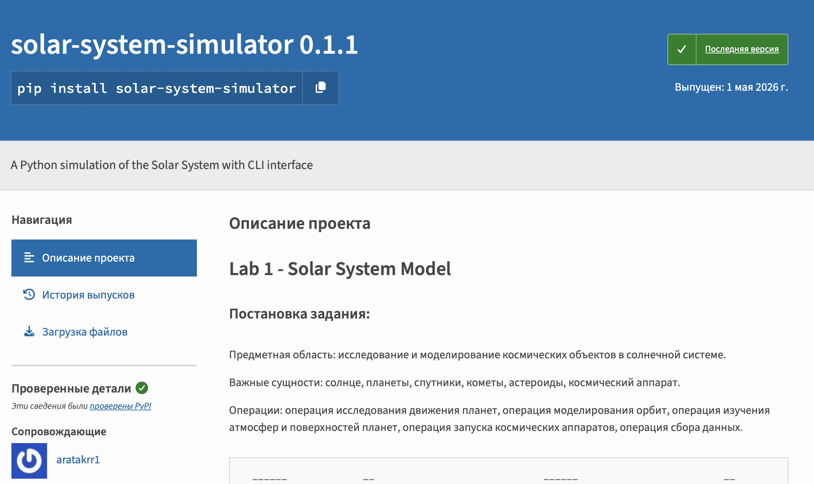

# Lab 4 - Reusage of code in lab 1

Для переиспользования кода из 1 лабораторной работы, весь код предметной области был преобразован в библиотеку и опубликован на <a href="https://pypi.org/project/solar-system-simulator/">PyPi</a>

</img>

Вывод: код из 1 лабы был переиспользован для добавления графического дизайна.